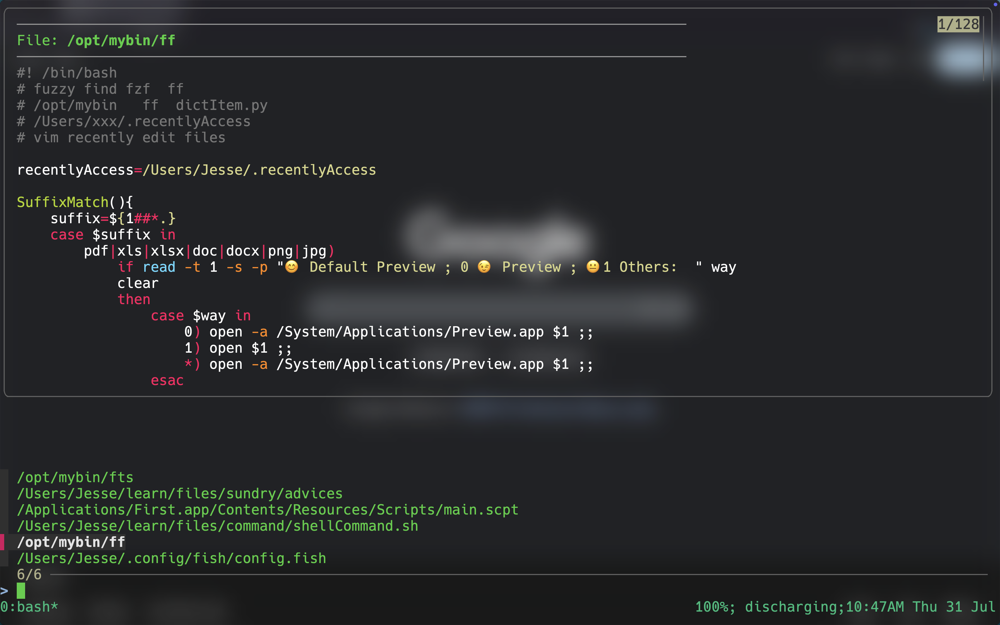

### FF Fuzzy Find 

inspired by fzf <https://github.com/junegunn/fzf> 

ff a command line search gadget inspired by fzf , auto clean merge add weight to recentlyAccess

### search sequence 

- recentlyAccess (sort by weight desc)

- viminfo (keep recently vim edited file)

- mdfind (mac spotlight command line stuff)

- after all search not match echo "Not Any Match 😳😳😳"

after match it will be  open by different app depends on different suffix

once recentlyAccess line count great or equal 50 it will auto invoke PurgeMerge

### Usage

- ff filename

  search from recentlyAccess/viminfo/mdfind

  

- ff  

  list current directory all files

  

- ff directory 

  list directory all files

  

- ff --merge / ff --purge

  merge/purge invoke PurgeMerge function cat recentlyAccess.tmp into recentlyAccess  and resort it  by weight desc

  and then  delete the  filename in recentlyAccess  that not exist

  PurgeMerge actuall use python dict dictItem.py to merge weight count

  

- ff --add fileName weightNum

  ff add file into recentlyAccess 

  example 

  ff --add aaa  // default add weightNum 1

  ff --add aaa 1 // add weight 1

  ff --add aaa 10 // add weight 10

  after add to recentlAccess immediately invoke PurgeMerger function in case recentlyAccess had this file before

### Requisite

- fzf
- fd
- bat
- ridgrep
- autojump
- fish shell

### FzF config

\#ignore stuff

export FZF_DEFAULT_COMMAND="fd --exclude={.git,.idea,.vscode,.sass-cache,node_modules,build} --type f"

\# if return result only one open it directly 

export FZF_DEFAULT_OPTS=" --select-1 --exit-0  --preview 'bat --color=always --style=header,grid --line-range :300 {}' --preview-window 'up:80%' "